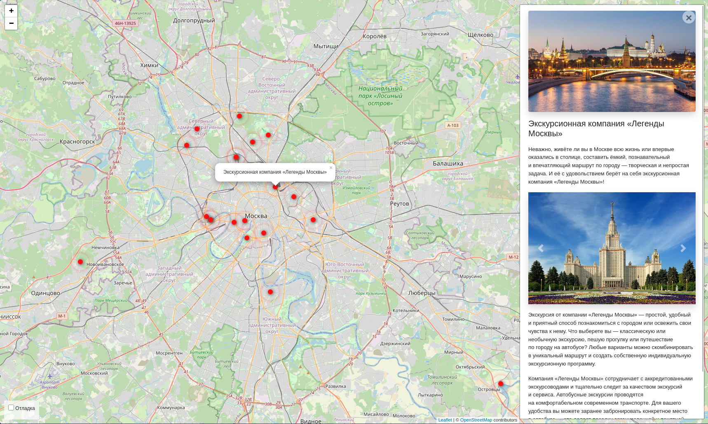
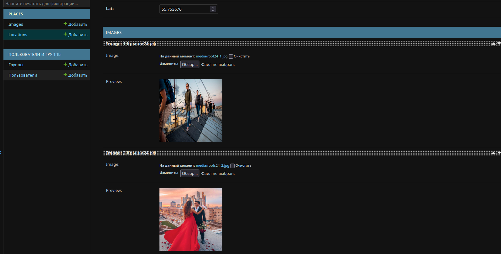

# where to go 

Данный проект представляет собой интерактивную карту Москвы, на которой находятся известные виды активного отдыха с подробным описанием.


## Начать использовать
Для демонстрации проекта перейдите по [ссылке](https://tonycleem.pythonanywhere.com/)


## Самостоятельный запуск проекта

### Подготовьте окружение:

>[python](https://www.python.org/) и [pip](https://pypi.org/project/pip/) должны быть установлены

Скачайте код проекта удобным для Вас способом, например:
```
git clone https://github.com/TonyCleem/where_to_go.git
```

### Установите зависимости:


>Примечание!  
Устанавливайте зависимости используя виртуальное окружение, подходящее для Вашей ОС.  
Например [venv](https://docs.python.org/3/library/venv.html)
```
pip install -r requirements.txt
```

### Подготовка и запуск:

- Измените `.env`.  
```
SECRET_KEY = <ключ для базы>

DEBUG = False # Для локального запуска, Вы также можете указать True

ALLOWED_HOSTS = [localhost, 127.0.0.1] # Или установите данные своего хоста

HOST = <Ваш хост>
PORT = <свободный порт>
```
- Примените миграции
```
python manage.py migrate
```

- Создайте профиль для админки
```
python manage.py createsuperuser
```
- Соберите статику (для web-сервера)
```python
python manage.py collectstatic
```
- Загрузите локации используя аргументы для `load_place`
```python
python manage.py load_place --help
```

- Запустите сайт
```
python manage.py runserver <ваш хост>:<свободный порт>
```
>Хост указывайте такой же как и в `ALLOWED_HOSTS`  


После этого в браузере перейдите на сайт `http://<Указанный вами хост>:<указанный Вами порт>`  
Например: `http://localhost:8001`

## Администрирование
Вы также можете упралять сайтом. Изменять локации и содержимое этих локаций

Для управления нужно перейти в админку по следующему URL:
```
http://<ваш хост>/admin
```


### Цель проекта
Код написан в образовательных целях на онлайн-курсе для веб-разработчиков [dvmn.org](https://dvmn.org/).
